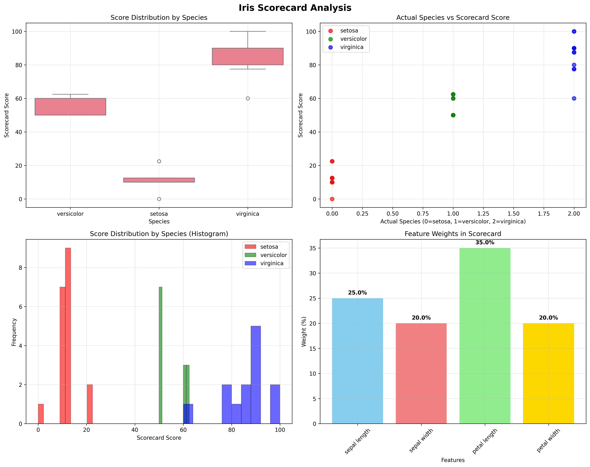

Iris Dataset Example
====================

**Goal:** Build an expert scorecard that classifies iris species using domain knowledge about petal/sepal measurements

**Why:** Shows how expert rules can create interpretable ML models that work with the sklearn ecosystem

Complete Example
----------------

.. code-block:: python

   import pandas as pd
   from sklearn.datasets import load_iris
   from sklearn.model_selection import train_test_split
   from risk_kit.expert_scorecard.models import ExpertScorecard, NumericFeature, NumericBucket
   from risk_kit.expert_scorecard.validation import ValidatorRegistry, FeatureWeightValidator

   # Load data
   iris = load_iris()
   X = pd.DataFrame(iris.data, columns=iris.feature_names)
   y = iris.target

   # Create validation registry
   registry = ValidatorRegistry()
   registry.register(FeatureWeightValidator)

   # Expert knowledge: petal length is most discriminative for iris species
   scorecard = ExpertScorecard(
       features=[
           NumericFeature(
               name="petal length (cm)",
               buckets=[
                   NumericBucket(definition=(0.0, 2.0), score=0),    # Setosa
                   NumericBucket(definition=(2.0, 5.0), score=50),   # Versicolor
                   NumericBucket(definition=(5.0, 7.0), score=100)   # Virginica
               ],
               weight=60
           ),
           NumericFeature(
               name="petal width (cm)",
               buckets=[
                   NumericBucket(definition=(0.0, 0.8), score=0),
                   NumericBucket(definition=(0.8, 1.8), score=50),
                   NumericBucket(definition=(1.8, 3.0), score=100)
               ],
               weight=40
           )
       ],
       validation_registry=registry
   )

   # Use with sklearn - no wrapper needed!
   X_train, X_test, y_train, y_test = train_test_split(X, y, test_size=0.3, random_state=42)
   scorecard.fit(X_train, y_train)
   predictions = scorecard.predict(X_test)

   print(f"Score range: [{predictions.min():.1f}, {predictions.max():.1f}]")

How Scoring Works
-----------------

.. code-block:: python

   # Show scoring breakdown for interpretability
   sample = X_test.iloc[0]
   print(f"Sample: {sample.to_dict()}")
   print(f"Total score: {scorecard.predict(sample.to_dict())[0]:.1f}")

   # Feature contributions
   for feature in scorecard.features:
       value = sample[feature.name]
       feature_score = feature.get_score(value)
       weighted_score = (feature_score * feature.weight) / 100.0
       print(f"  {feature.name}: {value:.1f} → {feature_score} pts × {feature.weight}% = {weighted_score:.1f}")

Analysis Visualization
----------------------

The following chart shows a comprehensive analysis of how the iris scorecard performs:

The visualization includes:
- **Score distribution by species**: Box plots showing how each species scores
- **Actual vs predicted correlation**: Scatter plot showing scorecard accuracy
- **Score histograms**: Distribution of scores with species overlay
- **Feature importance**: Bar chart showing the weight of each feature in the model

ML Integration
--------------

.. code-block:: python

   from sklearn.pipeline import Pipeline
   from sklearn.model_selection import cross_val_score
   import pickle

   # Works in sklearn pipelines
   pipeline = Pipeline([('scorecard', scorecard)])
   cv_scores = cross_val_score(pipeline, X, y, cv=3)
   print(f"Cross-validation scores: {cv_scores}")

   # Pickle for production
   pickle.dump(scorecard, open('iris_model.pkl', 'wb'))
   loaded_model = pickle.load(open('iris_model.pkl', 'rb'))

   # Test loaded model
   test_sample = {"petal length (cm)": 4.5, "petal width (cm)": 1.3}
   prediction = loaded_model.predict(test_sample)
   print(f"Loaded model prediction: {prediction[0]:.1f}")

Results
-------

The scorecard effectively separates iris species:
- **Setosa** (0-33): small petals
- **Versicolor** (33-66): medium petals
- **Virginica** (66-100): large petals

**Key takeaway:** Expert scorecards combine domain knowledge with ML best practices, creating models that are both interpretable and production-ready.
