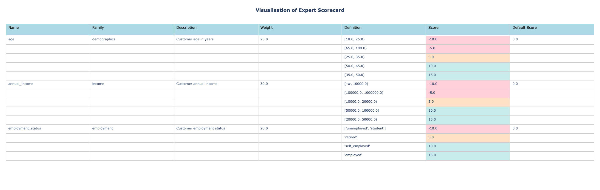

Scorecard Visualization
=======================

Risk-Kit provides built-in visualization capabilities to help you understand and communicate your scorecard structure.

Installation Requirements
-------------------------

Visualization features require additional dependencies:

.. code-block:: bash

   pip install risk-kit[viz]

This installs the optional plotly dependency needed for interactive visualizations.

Quick Example
-------------

.. code-block:: python

   from risk_kit.expert_scorecard.models import ExpertScorecard, NumericFeature, ObjectFeature
   from risk_kit.expert_scorecard.models.bucket import NumericBucket, ObjectBucket
   from risk_kit.expert_scorecard.visualisation import ScorecardVisualizer
   from risk_kit.expert_scorecard.validation import ValidatorRegistry, FeatureWeightValidator

   # Create validation registry
   registry = ValidatorRegistry()
   registry.register(FeatureWeightValidator)

   # Create a sample scorecard
   scorecard = ExpertScorecard(
       features=[
           NumericFeature(
               name="age",
               family="demographics",
               description="Customer age in years",
               buckets=[
                   NumericBucket(definition=(18.0, 25.0), score=-10.0),
                   NumericBucket(definition=(25.0, 35.0), score=5.0),
                   NumericBucket(definition=(35.0, 50.0), score=15.0),
                   NumericBucket(definition=(50.0, 65.0), score=10.0),
                   NumericBucket(definition=(65.0, 100.0), score=-5.0),
               ],
               weight=25.0
           ),
           NumericFeature(
               name="annual_income",
               family="income",
               description="Customer annual income",
               buckets=[
                   NumericBucket(definition=(0.0, 10000.0), score=-10.0),
                   NumericBucket(definition=(10000.0, 20000.0), score=5.0),
                   NumericBucket(definition=(20000.0, 50000.0), score=15.0),
                   NumericBucket(definition=(50000.0, 100000.0), score=10.0),
                   NumericBucket(definition=(100000.0, 1000000.0), score=-5.0),
               ],
               weight=30.0
           ),
           ObjectFeature(
               name="employment_status",
               family="employment",
               description="Customer employment status",
               buckets=[
                   ObjectBucket(definition="employed", score=15.0),
                   ObjectBucket(definition="self_employed", score=10.0),
                   ObjectBucket(definition=["unemployed", "student"], score=-10.0),
                   ObjectBucket(definition="retired", score=5.0),
               ],
               weight=20.0
           )
       ],
       validation_registry=registry
   )

   # Create visualization
   visualizer = ScorecardVisualizer(scorecard)
   fig = visualizer.create_scorecard_table()
   fig.show()

Scorecard Table Visualization
-----------------------------

The main visualization feature is the scorecard table, which displays all features, their buckets, scores, and weights in an organized format.

The table includes:

- **Feature**: Feature name and family grouping
- **Bucket Definition**: Value ranges or categories
- **Score**: Points assigned to each bucket
- **Weight**: Feature importance as percentage
- **Description**: Human-readable feature description

Color coding helps identify score ranges:

- **Low scores**: Red-tinted background
- **Medium scores**: Orange-tinted background
- **High scores**: Green-tinted background

Export Options
--------------

The visualizer supports multiple export formats:

.. code-block:: python

   # Save as HTML file
   visualizer.save_html("scorecard.html")

   # Get HTML string for embedding
   html_string = visualizer.to_html()

   # Get Plotly figure for further customization
   fig = visualizer.create_scorecard_table()
   fig.update_layout(title="Custom Title")

This makes it easy to include scorecard visualizations in reports, documentation, or web applications.
